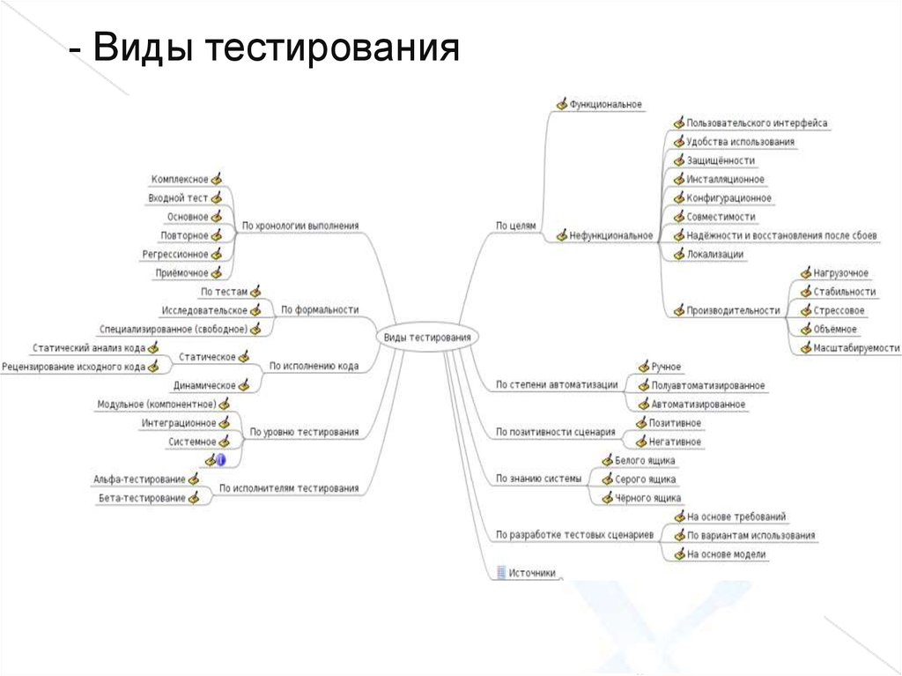

## 1.2 Классификация тестирования

Существует много различных классификаций тестирования и каждый автор обладает своим мнением по классификации тестирования. Поэтому когда вас спрашивают о той или иной классификации тестирования необходимо уточнять согласно какому источнику.

## Функциональное тестирование

Функциональное тестирование направлено на проверку того, что приложение работает в соответствии с требованиями и спецификациями. Оно включает проверку всех основных функций, а также взаимодействие с пользовательским интерфейсом и интеграцию с другими системами.

Примеры функционального тестирования:

*Проверка работы формы регистрации на веб-сайте.
Тестирование корректности выполнения математических операций в калькуляторе.*

1. **По доступу к коду**
+ **Black-box тестирование (методом «черного ящика»)** – подход, при котором в
  процессе тестирования мы не можем заглядывать «внутрь» компонента. Чаще используется
  в рамках системного или при определенных видах интеграционного тестирования.
+ **White-box тестирование (методом «белого ящика»)** – подход, при котором в
  процессе тестирования мы можем заглядывать «внутрь» компонента. Чаще используется
  при unit-тестировании, а также определенных типах интеграционного.
+ **Grey-box тестирование (методом «серого ящика»)** – промежуточный вид
  тестирования, при котором у нас есть доступ лишь к ряду компонентов системы.

2. **По запуску кода**

+ **статическое тестирование** – проводится без исполнения кода. Сюда относится корректура, проверка, ревизия кода (при наблюдении за работой другого / парном программировании), критический анализ, инспекции и так далее.
+ **динамическое тестирование** – это процесс проверки программного обеспечения путем его выполнения. Целью динамического тестирования является выявление ошибок в рабочем программном обеспечении и проверка его функциональности.
Динамическое тестирование может включать различные методы, такие как модульное тестирование, интеграционное тестирование, системное тестирование и приемочное тестирование.

3. **Связанные с изменение кода**
+ **регресивное тестирование** - тестирование уже протестированной программы, проводящееся после модификации для уверенности в том, что процесс модификации не внес или не активизировал ошибки в областях, не подвергавшихся изменениям. Проводится после изменений в коде программного продукта или его окружении.
+ **повторное тестирование** - тестирование, во время которого исполняются тестовые сценарии, выявившие ошибки во время последнего запуска, для подтверждения успешности исправления этих ошибок.

4. **По результату**
+ **позитивное тестирование** - направлено на исследование приложения в ситуации, когда все действия выполняются строго по инструкции без каких бы то ни было ошибок, отклонений, ввода неверных данных и т.д
+ **негативное тестирование** -  это тип тестирования программного обеспечения (ПО), направленный на проверку того, что система или приложение ведут себя должным образом в негативных ситуациях, то есть, когда они получают недопустимые или неожиданные входные данные.

5. **По исполнителю**
+ **альфа тестирование** - проводится на ранней стадии разработчиками, тестировщиками и аналитиками качества, которые являются сотрудниками организации
+ **бетта тестирование** - интенсивное использование почти готовой версии продукта (как правило, программного или аппаратного обеспечения) с целью выявления максимального числа ошибок в его работе для их последующего устранения перед окончательным

6. **По наличию тест-кейсов**

+ **тестиррвание по тест-кейсам** 
+ **исследовательское тестирование** -тестирование, основанное на опыте, при котором тестер спонтанно разрабатывает и выполняет тестирования на основе существующих соответствующих знаний тестера, предшествующих исследований элемента тестирования

## Нефункциональное тестирование

Нефункциональное тестирование оценивает качество приложения с точки зрения производительности, безопасности, надежности и других аспектов, которые не связаны с функциональностью.

Примеры нефункционального тестирования:

*Тестирование производительности приложения под нагрузкой.*
*Проверка безопасности данных и защиты от потенциальных атак.*

1. **Тестирование производительности**
это вид тестирования программного обеспечения, направленный на определение его способности работать с определенными рабочими нагрузками и в определенных условиях. Основная цель тестирования производительности — выявить проблемы, связанные с быстродействием, надежностью и стабильностью системы, а также определить возможные узкие места и точки отказа.
+ **нагрузочное** –  измеряет производительность системы по мере увеличения рабочей нагрузки. Он определяет, где и когда происходит прерывание работы приложения, чтобы можно было устранить проблему перед отправкой в рабочую среду. Это делается путем тестирования поведения системы при типичных и больших нагрузках.
+ **масштабируемости** – это процесс проверки способности системы, приложения или инфраструктуры обрабатывать работу в ожидаемых пределах. Такое тестирование направлено на определение того, как быстро система может расти в своей способности и количество задач, которые она может обработать без снижения производительности и ухудшения качества работы.
+ **объемное** –  проводится для оценки способности элемента тестирования обработать определенные объемы данных (обычно равных или близких к максимальным указанным потенциальным возможностям) с точки зрения потенциальных возможностей пропускной способности, емкости памяти или того и другого.
+ **стрессовое** – вид тестирования производительности, оценивающий систему/компонент на граничных значениях рабочих нагрузок либо за их пределами или же в состоянии ограниченных ресурсов, таких как память или доступ к серверу

2. **Тестирование установки** - это тип тестирования программного обеспечения, который проверяет процесс установки программного обеспечения и гарантирует, что программное обеспечение правильно установлено в различных системах и конфигурациях
3. **Тестирование интерфейса**-проверка интерфейсов приложения или его компонентов. Сюда относятся GUI (графический интерфейс), CLI (командная строка) и API (программный интерфейс приложения). 
4. **Тестирование локализации** -  это процесс тестирования локализованной версии программного продукта. Проверка правильности перевода элементов интерфейса пользователя, системных сообщений и ошибок, проверка перевода раздела «Помощь/Справка», сопроводительной документации и основного контента.
5. **Тестирование безопасности** - это процесс, направленный на выявление недостатков в механизмах безопасности информационной системы, которые защищают данные и поддерживают функциональность по назначению.
6. **Тестирование надежности** - это методология обеспечения качества, ориентированная на тестирование надежности программного обеспечения и помогающая устранить недостатки программного обеспечения путем поиска проблемных ситуаций путем ввода данных, имитирующих экстремальные условия окружающей среды, чтобы определить, достаточно ли надежна система для предоставления требуемой функциональности пользователю.
