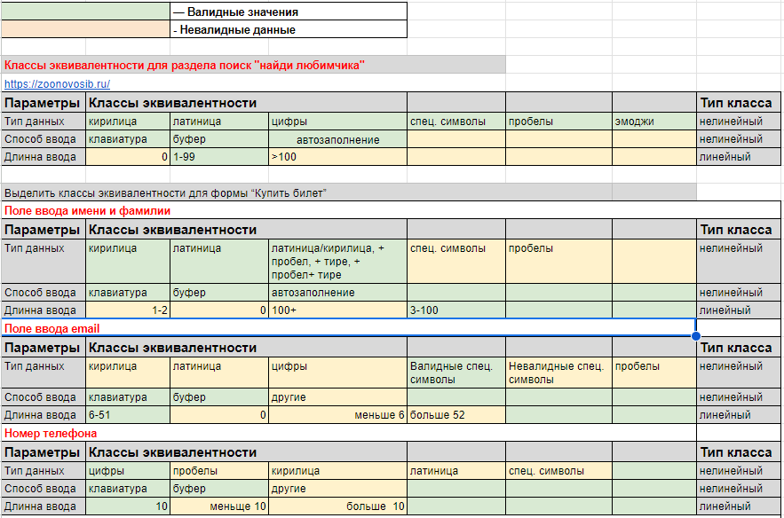
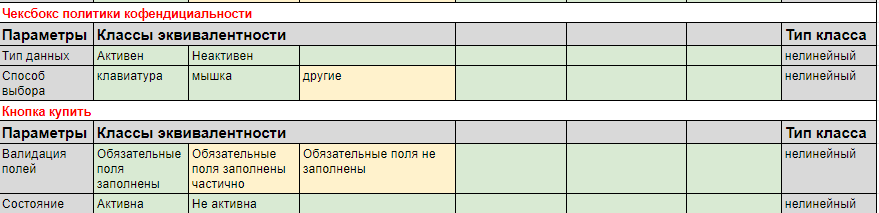
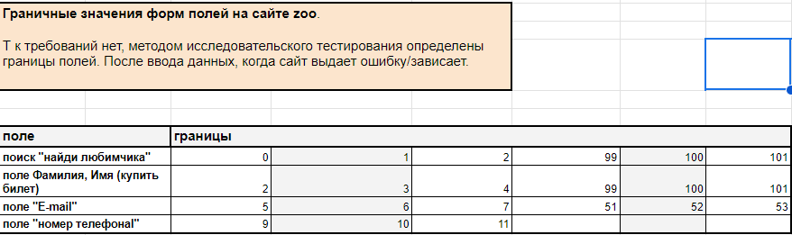
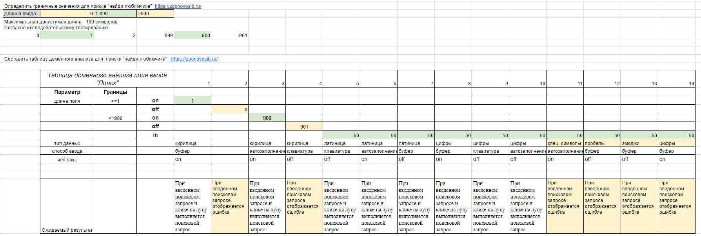
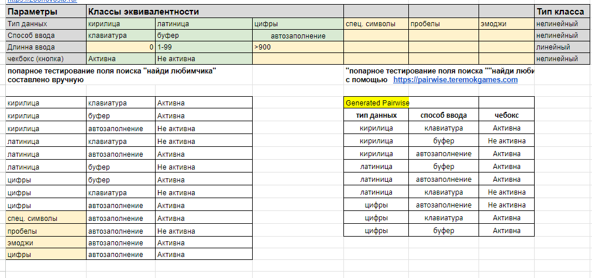

## 3.2 Популярные техники тест-дизайна

Техник тест-дизайна довольно много. Мы сосредоточимся на самых популярных:

* эквивалентное разделение
* анализ граничных значений
* переход состояний
* попарное тестирование
* предугадывание ошибок

Эквивалентное разделение  и анализ граничных значений направлены на сокращение количества необходимых тестовых сценариев. В связи с этим при разработке тестов для тестирования методом черного ящика эти техники применяются чаще всего.

## 1. Эквивалентное разделение
Эквивалентное разделение подразумевает разбиение тестовых данных на классы по какому-то признаку. Этот метод имеет смысл только в том случае, если компоненты чем-то похожи и могут войти в общую группу.

Если мы выбираем в качестве техники тест-дизайна эквивалентное разделение, это означает, что мы будем тестировать только несколько значений из каждого класса элементов. Помните, что это не гарантирует отсутствия ошибок в остальных значениях, не охваченных тестами. Мы лишь предполагаем, что использование нескольких элементов из каждой группы будет достаточно показательным.

Эквивалентное разделение — хорошее решение для случаев, когда вы имеете дело с большим объемом входящих данных или множеством одинаковых вариантов ввода. В противном случае, возможно, имеет смысл более тщательно охватить продукт тестами.

### *Классы эквивалентности на примере сайта*  https://zoonovosib.ru/

## 2. Анализ граничных значений
Анализ граничных значений в чем-то похож на эквивалентное разделение. Можно даже сказать, что оно лежит в основе анализа граничных значений. Но есть некоторые отличия.

При анализе граничных значений мы тоже группируем данные по эквивалентным классам, но проверяем не значения из определенного класса, а граничные значения — те, которые находятся на «границах» классов. 

Эта логика применяется для интеграционного тестирования. Мы проверяем отдельные элементы во время юнит-тестирования, а на следующем уровне ошибки, скорее всего, появятся на «стыках» юнитов.

### *Анализ граничных значений на примере сайта*  https://zoonovosib.ru/

## 3. Техника доменного тестирования

Доменное тестирование — это техника тестирования метода чёрного ящика, направленная на уменьшение количества тестов путём одновременной проверки множества различных позитивных значений. Данная техника базируется на одновременном использовании техник эквивалентного разбиения и анализа граничных значений.

### *Доменное тестирование на примере сайта*  https://zoonovosib.ru/

## 4. Попарное тестирование

Попарное тестирование основано на математических алгоритмах, а именно на комбинаторике. Оно позволяет создавать уникальные пары и тестировать огромное количество поступающих данных в разных сочетаниях, но расчеты могут быть сложными. 

Чтобы охватить тестовыми сценариями максимум фич и при этом потратить минимальное время на тестирование, нужно правильно сопоставлять данные, комбинируя пары определенным образом на основе расчетов.\

*Инструменты для попарного тестирования:* 

https://pairwise.teremokgames.com/

https://pairwise.yuuniworks.com/

### *Попарное тестирование на примере сайта*  https://zoonovosib.ru/

## 4. Переход состояний
Диаграмма перехода состояний визуализирует состояния программы в разные периоды времени и на разных этапах использования. Визуальную информацию воспринимать проще, чем текст. Таким образом, техника перехода состояний позволяет быстрее получить максимальное тестовое покрытие. 

Этот метод эффективен при создании наборов тестов для систем со множеством вариаций состояний. Он вам пригодится для тестирования последовательности событий с конечным числом входных параметров.
 
## 5. Предугадывание ошибок

Предугадывание ошибок обычно применяется вместе с другими техниками тест-дизайна. Суть этой техники в том, что тестировщик предугадывает, где могут появиться ошибки, опираясь на свой опыт, знание системы и требования к продукту. Таким образом он выявляет места, где могут накапливаться ошибки, и может уделить этим областям повышенное внимание.

*Пример предугадывания ошибок*.
Как правило, тестировщики начинают с тестирования на распространенные ошибки:

* ввод пробелов в текстовые поля
* нажатие кнопки Submit без ввода данных
* ввод неверных параметров (адрес электронной почты вместо номера телефона и т.д.)
* загрузка файлов, превышающих максимально допустимый размер
… и так далее.