Geekbrains

Факультет инженер по тестированию

# Исследовательское ручное тестирование сайта https://zoonovosib.ru/ 

**Дипломный проект**

студента 1 года обучения

специальности “Инженер по Тестированию”

Лобанова Е.С.

Руководитель

Шафигуллин И.К.

Новосибисрк

2023

**Дипломный проект “Исследовательское ручное тестирование сайта https://zoonovosib.ru/”**

**Содержание**

[TOC]

# Введение.
## Введение

Тестирование играет важную роль в современном мире, где компьютерные программы проникают во все сферы нашей жизни. Без надлежащего тестирования программы могут быть подвержены сбоям, что в конечном итоге может привести к непредсказуемым последствиям и неудовлетворенности пользователей. В силу этого, тестирование является неотъемлемой частью разработки нового программного обеспечения, гарантирующей его качество, надежность и эффективность

## Цели и задачи

Цель дипломной работы является закрепить все базовые знания по тестированию. Провести ручное тестирование сайта Новосибирского зоопарка при отсутствии спецификации к программному продукту и составить рекомендации по улучшению качества сайта. 

Задачами дипломной работы в связи с указанной целью являются  :

* изучить основные понятия теории тестирования;
* QA, AS и тестирование;
* модели разработки ПО 
* клиент сервисная архитектура;
* создание тест-плана сайта;
* создание чек -листа для тестирования сайта;
* создание тест -кейсов для тестирования сайта;
* произвести тестирование различных форм сайта
* создание баг-репортов;
* изучить и произвести тестирование с помощью DevTools;
* изучить различные методы формирования отчетов о тестировании.

## Объект и предмет исследования

Объектом дипломной работы является сайт Новосибирского Зоопарка https://zoonovosib.ru/
Предметом дипломной работы являются открытые источники в сети интернет, книги и курсы посвященные тестированию ПО.

Рекомендации

Дипломный проект представляет из себя курс по закреплению  (или расширению уже имеющихся) знаний в области ручного тестирования. Большая часть проекта направлена на практические примеры с применением исследовательского тестирования. Как правильно тестировать без требований. Какими инструментамии можно возспользоваться. 

# Глава 1. Теория тестирования.

## 1.1 Что такое тестирование

> Тестирование программного обеспечения - процесс исследования, испытания программного продукта, имеющий своей целью
> проверку соответствия между реальным поведением программы и её ожидаемым поведением на конечном наборе тестов,
> выбранных определенным образом.
>
> [wikipedia](https://ru.wikipedia.org/wiki/Тестирование_программного_обеспечения)

Святослав Куликов дает такое определение тестирования в своей книге «Тестирование программного обеспечения. Базовый
курс.»:

> Тестирование программного обеспечения — процесс анализа программного средства и сопутствующей документации с целью
> выявления дефектов и повышения качества продукта.
>
> [«Тестирование программного обеспечения. Базовый курс.»](https://svyatoslav.biz/software_testing_book/)

ISTQB, International Software Testing Qualifications Board.

> The process consisting of all lifecycle activities, both static and dynamic, concerned with planning, preparation and
> evaluation of a component or system and related work products to determine that they satisfy specified requirements,
> to demonstrate that they are fit for purpose and to detect defects.
>
> [ISTQB Glossary](https://glossary.istqb.org/en_US/term/testing-4-2)

## Цель тестирования

* проверка соответствия ПО предъявляемым требованиям
* повысить вероятность, что ПО будет работать хорошо в любых условиях
* предоставить актуальн
* поиск очевидных ошибок в программном обеспечении, которые должны быть выявлены до того, как их обнаружат пользователи программы

## Кто такой тестировщик?

**Тестировщик** - специалист заботящийся о качестве системы в виде обнаружения дефектов до того, как их обнаружат пользователи системы.

## Различие между Tester/QC/QA

**QA** (Quality Assurance) — Обеспечение качества продукта — продумать и построить процесс разработки так, чтобы продукт был качественным и чтобы в нем было меньше багов.
К задачам обеспечения качества относятся:

* проверка технических характеристик и требований к ПО;
* оценка рисков;
* планирование задач для улучшения качества продукции;
* подготовка документации, тестового окружения и данных;

**QC** (Quality Control) — Контроль качества продукта — анализ результатов тестирования и качества новых версий выпускаемого продукта.

К задачам контроля качества относятся:
* проверка готовности ПО к релизу;
* проверка соответствия требований и качества данного проекта.

**Тестирование** — это уже непосредственно процесс проверки результатов работы на соответствие установленным требованиям.

## Верификация и валидация
два понятия тесно связаны с процессами тестирования и обеспечения качества.

**Верификация** (verification) — это процесс оценки системы, чтобы понять, удовлетворяют ли результаты текущего этапа разработки условиям, которые были сформулированы в его начале.

**Валидация** (validation) — это определение соответствия разрабатываемого ПО ожиданиям и потребностям пользователя, его требованиям к системе.

## Этапы тестирования:

1. Анализ продукта
2. Работа с требованиями
3. Разработка стратегии тестирования и планирование процедур контроля качества
4. Создание тестовой документации
5. Тестирование прототипа
6. Основное тестирование
7. Стабилизация
8. Эксплуатация

## 1.2 Классификация тестирования

Существует много различных классификаций тестирования и каждый автор обладает своим мнением по классификации тестирования. Поэтому когда вас спрашивают о той или иной классификации тестирования необходимо уточнять согласно какому источнику.

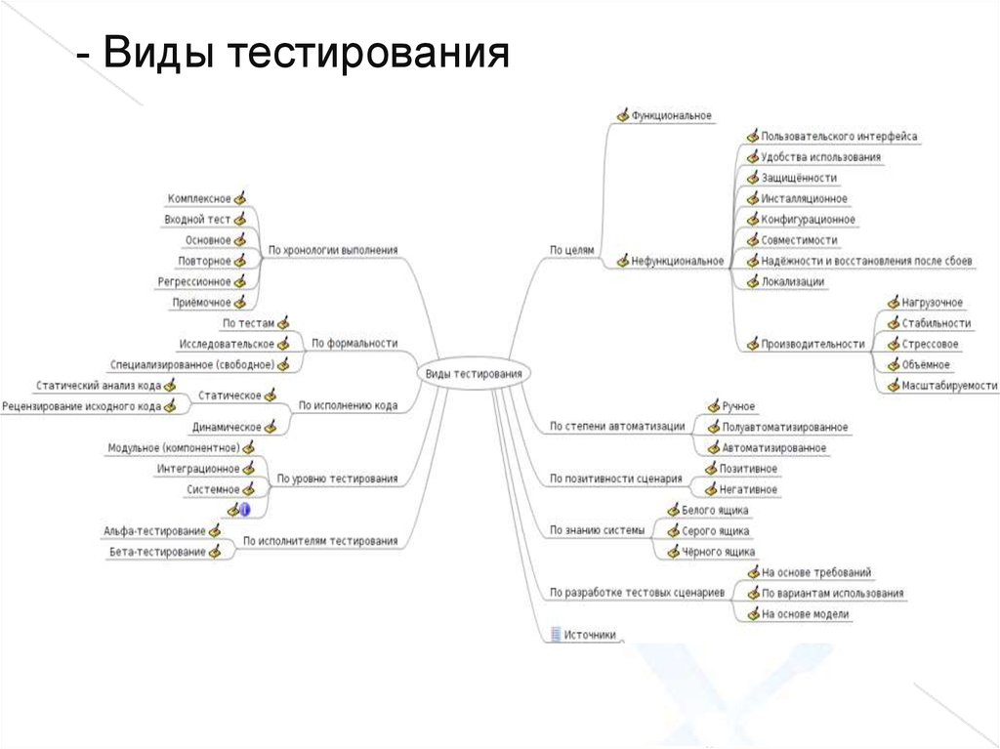

## Функциональное тестирование

Функциональное тестирование направлено на проверку того, что приложение работает в соответствии с требованиями и спецификациями. Оно включает проверку всех основных функций, а также взаимодействие с пользовательским интерфейсом и интеграцию с другими системами.

Примеры функционального тестирования:

*Проверка работы формы регистрации на веб-сайте.
Тестирование корректности выполнения математических операций в калькуляторе.*

1. **По доступу к коду**
+ **Black-box тестирование (методом «черного ящика»)** – подход, при котором в
  процессе тестирования мы не можем заглядывать «внутрь» компонента. Чаще используется
  в рамках системного или при определенных видах интеграционного тестирования.
+ **White-box тестирование (методом «белого ящика»)** – подход, при котором в
  процессе тестирования мы можем заглядывать «внутрь» компонента. Чаще используется
  при unit-тестировании, а также определенных типах интеграционного.
+ **Grey-box тестирование (методом «серого ящика»)** – промежуточный вид
  тестирования, при котором у нас есть доступ лишь к ряду компонентов системы.

2. **По запуску кода**

+ **статическое тестирование** – проводится без исполнения кода. Сюда относится корректура, проверка, ревизия кода (при наблюдении за работой другого / парном программировании), критический анализ, инспекции и так далее.
+ **динамическое тестирование** – это процесс проверки программного обеспечения путем его выполнения. Целью динамического тестирования является выявление ошибок в рабочем программном обеспечении и проверка его функциональности.
Динамическое тестирование может включать различные методы, такие как модульное тестирование, интеграционное тестирование, системное тестирование и приемочное тестирование.

3. **Связанные с изменение кода**
+ **регресивное тестирование** - тестирование уже протестированной программы, проводящееся после модификации для уверенности в том, что процесс модификации не внес или не активизировал ошибки в областях, не подвергавшихся изменениям. Проводится после изменений в коде программного продукта или его окружении.
+ **повторное тестирование** - тестирование, во время которого исполняются тестовые сценарии, выявившие ошибки во время последнего запуска, для подтверждения успешности исправления этих ошибок.

4. **По результату**
+ **позитивное тестирование** - направлено на исследование приложения в ситуации, когда все действия выполняются строго по инструкции без каких бы то ни было ошибок, отклонений, ввода неверных данных и т.д
+ **негативное тестирование** -  это тип тестирования программного обеспечения (ПО), направленный на проверку того, что система или приложение ведут себя должным образом в негативных ситуациях, то есть, когда они получают недопустимые или неожиданные входные данные.

5. **По исполнителю**
+ **альфа тестирование** - проводится на ранней стадии разработчиками, тестировщиками и аналитиками качества, которые являются сотрудниками организации
+ **бетта тестирование** - интенсивное использование почти готовой версии продукта (как правило, программного или аппаратного обеспечения) с целью выявления максимального числа ошибок в его работе для их последующего устранения перед окончательным

6. **По наличию тест-кейсов**

+ **тестиррвание по тест-кейсам** 
+ **исследовательское тестирование** -тестирование, основанное на опыте, при котором тестер спонтанно разрабатывает и выполняет тестирования на основе существующих соответствующих знаний тестера, предшествующих исследований элемента тестирования

### Нефункциональное тестирование

Нефункциональное тестирование оценивает качество приложения с точки зрения производительности, безопасности, надежности и других аспектов, которые не связаны с функциональностью.

Примеры нефункционального тестирования:

*Тестирование производительности приложения под нагрузкой.*
*Проверка безопасности данных и защиты от потенциальных атак.*

1. **Тестирование производительности**
это вид тестирования программного обеспечения, направленный на определение его способности работать с определенными рабочими нагрузками и в определенных условиях. Основная цель тестирования производительности — выявить проблемы, связанные с быстродействием, надежностью и стабильностью системы, а также определить возможные узкие места и точки отказа.
+ **нагрузочное** –  измеряет производительность системы по мере увеличения рабочей нагрузки. Он определяет, где и когда происходит прерывание работы приложения, чтобы можно было устранить проблему перед отправкой в рабочую среду. Это делается путем тестирования поведения системы при типичных и больших нагрузках.
+ **масштабируемости** – это процесс проверки способности системы, приложения или инфраструктуры обрабатывать работу в ожидаемых пределах. Такое тестирование направлено на определение того, как быстро система может расти в своей способности и количество задач, которые она может обработать без снижения производительности и ухудшения качества работы.
+ **объемное** –  проводится для оценки способности элемента тестирования обработать определенные объемы данных (обычно равных или близких к максимальным указанным потенциальным возможностям) с точки зрения потенциальных возможностей пропускной способности, емкости памяти или того и другого.
+ **стрессовое** – вид тестирования производительности, оценивающий систему/компонент на граничных значениях рабочих нагрузок либо за их пределами или же в состоянии ограниченных ресурсов, таких как память или доступ к серверу

2. **Тестирование установки** - это тип тестирования программного обеспечения, который проверяет процесс установки программного обеспечения и гарантирует, что программное обеспечение правильно установлено в различных системах и конфигурациях
3. **Тестирование интерфейса**-проверка интерфейсов приложения или его компонентов. Сюда относятся GUI (графический интерфейс), CLI (командная строка) и API (программный интерфейс приложения). 
4. **Тестирование локализации** -  это процесс тестирования локализованной версии программного продукта. Проверка правильности перевода элементов интерфейса пользователя, системных сообщений и ошибок, проверка перевода раздела «Помощь/Справка», сопроводительной документации и основного контента.
5. **Тестирование безопасности** - это процесс, направленный на выявление недостатков в механизмах безопасности информационной системы, которые защищают данные и поддерживают функциональность по назначению.
6. **Тестирование надежности** - это методология обеспечения качества, ориентированная на тестирование надежности программного обеспечения и помогающая устранить недостатки программного обеспечения путем поиска проблемных ситуаций путем ввода данных, имитирующих экстремальные условия окружающей среды, чтобы определить, достаточно ли надежна система для предоставления требуемой функциональности пользователю.

## 1.3 Модели разработки ПО

**Модель разработки ПО** (Software Development Model, SDM) - структура, систематизирующая различные виды проектной деятельности, их взаимодействие и последовательность в процессе разработки ПО. Выбор той или иной модели зависит от масштаба и сложности проекта, предметной области, доступных ресурсов и множества других факторов. Выбор модели разработки ПО серьёзно влияет на процесс тестирования, определяя выбор стратегии, расписание, необходимые ресурсы и т.д.

**Водопадная модель** (waterfall model)  Она предполагает однократное выполнение каждой из фаз проекта, которые, в свою очередь, строго следуют друг за другом. Очень упрощенно можно сказать, что в рамках этой модели в любой момент времени команде «видна» лишь предыдущая и следующая фаза. В реальной же разработке ПО приходится «видеть весь проект целиком» и возвращаться к предыдущим фазам, чтобы исправить недоработки или что-то уточнить.

К недостаткам водопадной модели принято относить тот факт, что участие пользователей ПО в ней либо не предусмотрено вообще, либо предусмотрено лишь косвенно на стадии однократного сбора требований. С точки зрения же тестирования эта модель плоха тем, что тестирование в явном виде появляется здесь лишь с середины развития проекта, достигая своего максимума в самом конце.

**V-образная модель** (V-model)

_V-модель (V-model): Модель, описывающая процессы жизненного цикла разработки программного обеспечения с момента составление спецификации требований до этапа сопровождения. V модель показывает интеграцию процессов тестирования в каждую фазу цикла разработки программного обеспечения. (ISTQB)_

**Итерационная инкрементальная модель** (iterative model, incremental model)

_Инкрементная модель разработки (incremental development model): Модель жизненного цикла разработки, в которой проект разделен на серию приращений, каждое из которых добавляет часть функциональности в общих требованиях проекта. Требования приоритезированы и внедряются в порядке приоритетов. В некоторых (но не во всех) версиях этой модели жизненного цикла каждый подпроект следует «мини V-модели» со своими собственными фазами проектирования, кодирования и тестирования. (ISTQB)_

_Итеративная модель разработки (iterative development model): Модель жизненного цикла разработки, в которой проект разделен обычно на большое количество итераций. Итерация это полный цикл разработки, завершающийся выпуском (внутренним или внешним) рабочего продукта, являющегося частью конечного разрабатываемого продукта, который разрастается от итерации к итерации. (ISTQB)_

Итерационная инкрементальная модель является фундаментальной основой современного подхода к разработке ПО. Ключевой особенностью данной модели является разбиение проекта на относительно небольшие промежутки (итерации), каждый из которых в общем случае может включать в себя все классические стадии, присущие водопадной и v-образной моделям. Итогом итерации является приращение (инкремент) функциональности продукта, выраженное в промежуточном билде (build).

**Спиральная модель** (spiral model)

Спиральная модель представляет собой частный случай итерационной инкрементальной модели, в котором особое внимание уделяется управлению рисками, в особенности влияющими на организацию процесса разработки проекта и контрольные точки.

Обратите внимание на то, что здесь явно выделены четыре ключевые фазы:

* проработка целей, альтернатив и ограничений;
* анализ рисков и прототипирование;
* разработка (промежуточной версии) продукта;
* планирование следующего цикла.

С точки зрения тестирования и управления качеством повышенное внимание рискам является ощутимым преимуществом при использовании спиральной модели для разработки концептуальных проектов, в которых требования естественным образом являются сложными и нестабильными (могут многократно меняться по ходу выполнения проекта).

**Гибкая модель (agile model)**

_Гибкая методология разработки программного обеспечения (agile software development): Группа методологий разработки программного обеспечения, основанных на итеративной поэтапной разработке, где требования и решения развиваются посредством сотрудничества между самоорганизующимися межфункциональными командами. (ISTQB)_

Гибкая модель представляет собой совокупность различных подходов к разработке ПО и базируется на т.н. «agile-манифесте». Положенные в основу гибкой модели подходы являются логическим развитием и продолжением всего того, что было за десятилетия создано и опробовано в водопадной, v-образной, итерационной инкрементальной, спиральной и иных моделях. Причём здесь впервые был достигнут ощутимый результат в снижении бюрократической составляющей и максимальной адаптации процесса разработки ПО к мгновенным изменениям рынка и требований заказчика.

Очень упрощенно (почти на грани допустимого) можно сказать, что гибкая модель представляет собой облегченную с точки зрения документации смесь итерационной инкрементальной и спиральной моделей; при этом следует помнить об «agile-манифесте» и всех вытекающих из него преимуществах и недостатках.

Главным недостатком гибкой модели считается сложность ее применения к крупным проектам, а также частое ошибочное внедрение ее подходов, вызванное недопониманием фундаментальных принципов модели. Тем не менее можно утверждать, что всё больше и больше проектов начинают использовать гибкую модель разработки.

# Глава 2. Клиент-сервисная архитектура.
## 2.1 Основы клиент-серверной архитектуры.

Клиент-серверная архитектура предполагает разделение функциональности приложения на две части: клиентскую и серверную. Клиентская часть отвечает за взаимодействие с пользователем, а серверная часть обрабатывает запросы клиента, выполняет задачи и возвращает результаты.

Примером клиент-серверной архитектуры может служить веб-приложение, где браузер является клиентом, а веб-сервер – сервером.

Тестирование клиент-серверных архитектур включает в себя проверку следующих аспектов:

1. **Функциональное тестирование**– проверка корректности работы отдельных функций клиентской и серверной частей приложения.

2. **Тестирование производительности**– определение скорости и эффективности выполнения запросов сервером и клиентом.

3. **Тестирование безопасности** – проверка наличия уязвимостей и обеспечение защиты данных и системы в целом.

4. **Тестирование совместимости** – проверка корректной работы приложения на разных платформах, операционных системах и браузерах.

Примеры тестирования клиент-серверных архитектур
Давайте рассмотрим некоторые примеры тестирования клиент-серверных архитектур:

*Функциональное тестирование* может включать проверку корректности работы форм ввода данных на клиентской стороне и обработку этих данных сервером.

*Тестирование производительности* может охватывать оценку времени ответа сервера на запросы клиента и определение возможной нагрузки на сервер.

*Тестирование безопасности* может включать анализ защиты от атак на сервер, таких как SQL-инъекции или XSS-атаки.

*Тестирование совместимости* может охватывать проверку корректной работы приложения в разных браузерах, на различных операционных системах и в разных версиях клиентского программного обеспечения.

# Глава 3. Техники тест-диайна
## 3.1 Что такое тест-дизайн?

это этап процесса тестирования, в ходе которого мы создаем тест-кейсы и намечаем структуру действий, связанных с тестированием проекта. На этом этапе команда определяет, как с минимальными усилиями расширить тестовое покрытие.
## Зачем нужен тест-дизайн?
Основная цель тест-дизайна — структурировать процедуры тестирования, чтобы было легче отслеживать покрытие требований тест-кейсами. Благодаря тест-дизайну мы:

* создаем тесты, помогающие выявлять серьезные ошибки
* вдумчиво подходим к тестированию и не тратим ресурсы впустую
*сводим к минимуму количество тестов, необходимых для тестирования продукта.

## 3.2 Популярные техники тест-дизайна

Техник тест-дизайна довольно много. Мы сосредоточимся на самых популярных:

* эквивалентное разделение
* анализ граничных значений
* переход состояний
* попарное тестирование
* предугадывание ошибок

Эквивалентное разделение  и анализ граничных значений направлены на сокращение количества необходимых тестовых сценариев. В связи с этим при разработке тестов для тестирования методом черного ящика эти техники применяются чаще всего.

## 1. Эквивалентное разделение
Эквивалентное разделение подразумевает разбиение тестовых данных на классы по какому-то признаку. Этот метод имеет смысл только в том случае, если компоненты чем-то похожи и могут войти в общую группу.

Если мы выбираем в качестве техники тест-дизайна эквивалентное разделение, это означает, что мы будем тестировать только несколько значений из каждого класса элементов. Помните, что это не гарантирует отсутствия ошибок в остальных значениях, не охваченных тестами. Мы лишь предполагаем, что использование нескольких элементов из каждой группы будет достаточно показательным.

Эквивалентное разделение — хорошее решение для случаев, когда вы имеете дело с большим объемом входящих данных или множеством одинаковых вариантов ввода. В противном случае, возможно, имеет смысл более тщательно охватить продукт тестами.

### *Классы эквивалентности на примере сайта*  https://zoonovosib.ru/

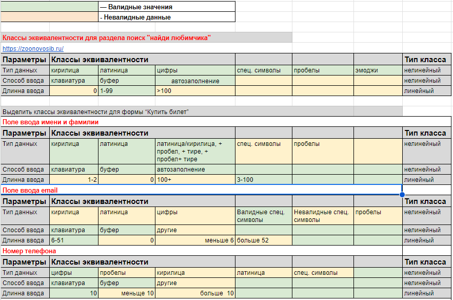
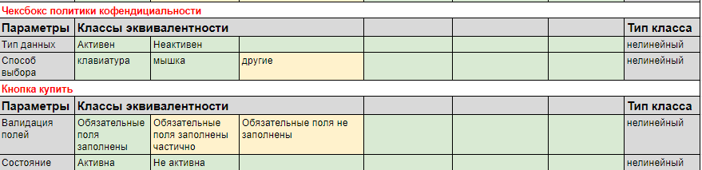

## 2. Анализ граничных значений
Анализ граничных значений в чем-то похож на эквивалентное разделение. Можно даже сказать, что оно лежит в основе анализа граничных значений. Но есть некоторые отличия.

При анализе граничных значений мы тоже группируем данные по эквивалентным классам, но проверяем не значения из определенного класса, а граничные значения — те, которые находятся на «границах» классов. 

Эта логика применяется для интеграционного тестирования. Мы проверяем отдельные элементы во время юнит-тестирования, а на следующем уровне ошибки, скорее всего, появятся на «стыках» юнитов.

### *Анализ граничных значений на примере сайта*  https://zoonovosib.ru/

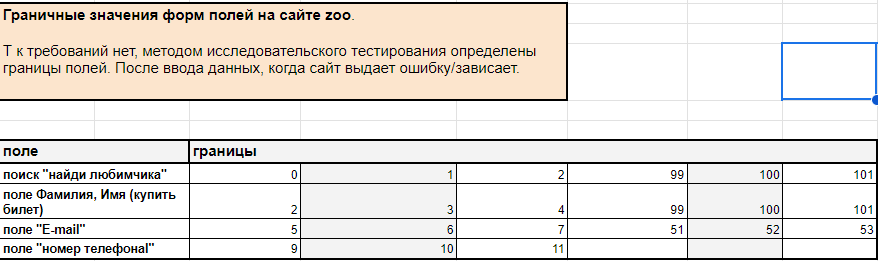

## 3. Техника доменного тестирования

Доменное тестирование — это техника тестирования метода чёрного ящика, направленная на уменьшение количества тестов путём одновременной проверки множества различных позитивных значений. Данная техника базируется на одновременном использовании техник эквивалентного разбиения и анализа граничных значений.

### *Доменное тестирование на примере сайта*  https://zoonovosib.ru/

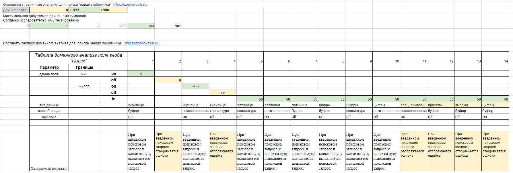

## 4. Попарное тестирование

Попарное тестирование основано на математических алгоритмах, а именно на комбинаторике. Оно позволяет создавать уникальные пары и тестировать огромное количество поступающих данных в разных сочетаниях, но расчеты могут быть сложными. 

Чтобы охватить тестовыми сценариями максимум фич и при этом потратить минимальное время на тестирование, нужно правильно сопоставлять данные, комбинируя пары определенным образом на основе расчетов.\

*Инструменты для попарного тестирования:* 

https://pairwise.teremokgames.com/

https://pairwise.yuuniworks.com/

### *Попарное тестирование на примере сайта*  https://zoonovosib.ru/

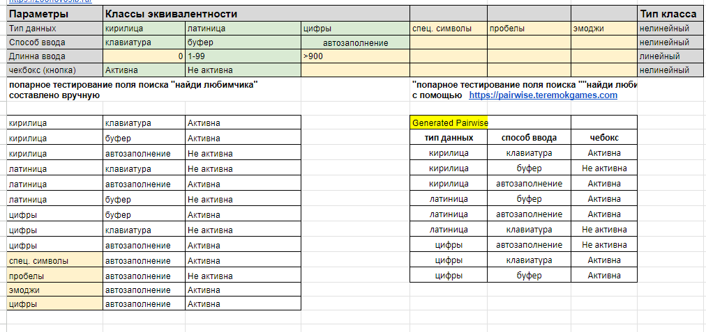

## 4. Переход состояний
Диаграмма перехода состояний визуализирует состояния программы в разные периоды времени и на разных этапах использования. Визуальную информацию воспринимать проще, чем текст. Таким образом, техника перехода состояний позволяет быстрее получить максимальное тестовое покрытие. 

Этот метод эффективен при создании наборов тестов для систем со множеством вариаций состояний. Он вам пригодится для тестирования последовательности событий с конечным числом входных параметров.
 
## 5. Предугадывание ошибок

Предугадывание ошибок обычно применяется вместе с другими техниками тест-дизайна. Суть этой техники в том, что тестировщик предугадывает, где могут появиться ошибки, опираясь на свой опыт, знание системы и требования к продукту. Таким образом он выявляет места, где могут накапливаться ошибки, и может уделить этим областям повышенное внимание.

*Пример предугадывания ошибок*.
Как правило, тестировщики начинают с тестирования на распространенные ошибки:

* ввод пробелов в текстовые поля
* нажатие кнопки Submit без ввода данных
* ввод неверных параметров (адрес электронной почты вместо номера телефона и т.д.)
* загрузка файлов, превышающих максимально допустимый размер
… и так далее.

# Глава 4. Тестовая документация.
## 4.1 Что такое тестовая документация?
Тестовая документация — это набор документов, создаваемых перед началом процесса тестирования и непосредственно в процессе. Эти документы описывают покрытие тестами и процесс выполнения тестов, в них указываются необходимые для тестирования вещи, приводится основная терминология и т. д. 

В тестовой документации любой член команды может найти полную информацию обо всех действиях, связанных с тестированием (и об уже выполненных, и о запланированных).

## В чем важность тестовой документации?

Если тестирование не документируется, это мешает увидеть полную картину проекта. Без четких целей, пошагового плана по их достижению и указания всех важных условий ожидаемый результат будет неясен. В таких условиях у всех может быть разное понимание общей цели и конечного продукта.

Тестовая документация определяет, что для нас важно и почему, какие действия мы должны выполнить и сколько времени у нас есть. Наконец, в документации обозначено, чего должна достичь команда и что сигнализирует об окончании процесса.

И QA-инженеры, и клиенты могут хотеть получить на выходе приложение, вообще не имеющее багов. Но это не достижимая цель, а мечты. Поэтому имеет смысл обсудить, что будет определять конец фазы QA. 

**Какую тестовую документацию используют QA-команды?**
* **План тестирования** (test plan)
*описывает все действия по тестированию в рамках одного проекта. Здесь вы можете найти информацию обо всем, что нужно сделать тестировщику или команде QA в ходе проекта.*
* **Чеклист (checklist)**
*это документ, содержащий краткое описание функций, которые должен проверить тестировщик.*
* **Тест-кейс (test case)**
*В тест-кейсе содержатся:
подробное описание шагов и действий, которые тестировщик должен выполнить для тестирования какой-то одной части функционала, критерии  прохождения тестов.*
* **Баг-репорт (bug-report)** *предоставляет полную информацию о баге (его описание, серьезность, приоритет и т. д.) и документирует шаги и условия для воспроизведения этого бага.*
* **Требования (requirements specification)** 
*Спецификация требований или просто требования — это полное описание разрабатываемого программного обеспечения.*

# Глава 5. Тест-план.
## 5.1 Структура тест плана

Тест план имеет четкую структуру, установленную IEEE 829 — отраслевым стандартом для документации тестирования программ и систем.

1. **Идентификатор тест плана**. 
В этом разделе мы указываем название и логотип компании, проводящей тестирование, название документа, его версию и год создания. Это титульная страница вашего тест плана.

2. **Ссылки**.
Дальше идет история документа. 
* дата
* версия
* описание
* автор

3. **Введение**
— это пояснительная записка для клиента. В паре предложений опишите, какие услуги предоставит команда QA и зачем. 
Включите все виды тестирования, которые вы согласились осуществить, но не входите в детали. На этом этапе достаточно обозначить все в общих чертах.

4. **Объекты тестирования**
— это общие функциональные возможности, которые будут протестированы. Например, установка программы, регистрация в системе, оформление заказа и т. д. По сути, это краткое содержание тест плана. В дальнейшем каждый из объектов будет описан отдельно. Список может быть расширен или сокращен в зависимости от задач или типа тестирования.

5. **Проблемы и риски**.
В этом разделе мы описываем проблемы, с которыми команда может столкнуться во время тестирования. Например, если дедлайн установлен на летний период, разумно предположить, что люди могут уйти в отпуск, из-за чего возможны задержки. Здесь нужно упомянуть все значимые проблемы и риски: как связанные с кадрами, так и технологические аспекты.

6. **Функции, которые нужно протестировать**.
Эта часть охватывает то, что, по мнению большинства людей, и должно быть в тест плане: подробный список функций для проверки и время, за которое они должны быть проверены.

7. **Функции, которые не нужно тестировать**
Здесь вы перечисляете функции, которые тестировщики по каким-то причинам не будут тестировать. Неважно, почему вы не покрываете тестами эти фичи. Просто не забудьте указать, какие именно функции не охватываются тестированием и остаются в зоне ответственности клиента.

8. **Подходы**
Затем мы описываем методы и виды тестирования, которые будем применять. В этот раздел также включаются тест-кейсы. Благодаря этому клиент может получить полную картину действий по тестированию.

9. **Критерии прохождения тестов**
Каждый тест-кейс будет обозначен как «Pass» (пройден) или «Fail» (провален) в зависимости от двух критериев:

* Наличие и серьезность багов
* Уровень успешно выполненных требований.
И не забудьте определить критерии начала и окончания тестирования. 

Критерии начала — то, что должно быть и что нужно сделать до начала тестирования. Например, вам могут понадобиться:

* законченная справочная документация
* программный продукт в том виде, в котором его будут получать клиенты
* специальные программные утилиты, конфигурационные файлы или данные
* требования к продукту и прочая документация и т.д.

Критерии окончания тестирования — это то, что вы считаете необходимым для завершения процесса тестирования. 

Пример критериев окончания тестирования:

«Все запланированные тесты проведены, все исправленные баги отмечены, сделаны уведомления обо всех новых обнаруженных багах. Все точки отказа (например, провал определенного набора тестов из-за неисправности железа) задокументированы».

10. **Критерии остановки и требования для возобновления тестирования**.
Критерии остановки/возобновления описывают ситуацию, когда тестирование невозможно продолжать из-за найденных багов. Другими словами, если дела идут так плохо, что запланированные тесты нельзя провести, тестирование нужно остановить до устранения блокирующих багов.

11. **Результаты тестирования**.
Чтобы засвидетельствовать результаты проведенной работы, мы отправляем их клиенту. Обычно результаты тестирования оформляют при помощи различных показателей: количество завершенных тестов, найденные баги и т.д. В некотором смысле эти показатели — индикаторы качества тестирования, хотя и не должны быть единственным критерием для оценки проделанной работы.

12. **Оставшиеся задачи тестирования**.
Жизненный цикл  ПО может быть непредсказуемым. Иногда проверка продукта занимает больше времени, чем первоначально ожидалось. Если времени мало, некоторые части функциональности могут оставаться непроверенными. В таком случае команда включает оставшиеся задачи в тест план. Кроме того, в этом разделе можно описать масштаб необходимой работы на случай, если все задачи будут закрыты до дедлайна.

13. **Требования среды**.
В целом, в этом разделе описывается, что нужно для тестирования по части аппаратного обеспечения. Здесь мы перечисляем и инструменты, используемые для тестирования. 

14. **Требования по части кадров и их обучения**

15. **Обязанности**
В этом разделе описываются сферы ответственности каждого члена команды QA. Удобно составить таблицу с тремя столбцами — имя, должность и обязанности.

16. **Расписание**
Тест план должен также включать дедлайны. Команде нужно как-то оценивать скорость работы. Для этого им нужно знать, сколько времени отводится на тестирование. Если есть несколько этапов тестирования, нужно расписать их порядок и сроки.

17. **Планирование рисков и непредвиденных обстоятельств**.
Этот раздел перекликается с п. 5 «Проблемы и риски». Здесь, в дополнение к перечню рисков, мы предоставляем разъяснения о том, как справиться с этими рисками, и что делать в случае форс-мажорных обстоятельств.

18. **Утверждение**.
Каждый тест план должен содержать информацию о том, кто его составлял (имя, должность), и о том, кто его должен одобрить.

19. **Глоссарий**.
В этом разделе вы можете пояснить основные термины, используемые при написании тест плана. Глоссарий помогает предотвратить неправильное толкование используемой терминологии.

 
 
 
 

## **Сайт https://zoonovosib.ru/**

## **Тест план**  
 
 
 
 

Предоставлено для: GeekBrains

Предоставил: Лобанова Евгения Сергеевна

Дата: 10.09.2023

Версия: V 1.0.0
 
 
 
 
## Содержание
1. Введение  
1.1 Цель  
1.2 Исходные данные  
1.3 Цели тестирования

2. Условия для тестирования
3. Стратегия процесса тестирования  
3.1 Типы тестирования  
3.1.1 Функциональное тестирование  
3.1.2 Кроссбраузерное тестирование  
3.1.3 Юзабилити тестирование  
3.1.4 Проверка на мобильном устройстве 
4. План работы
5. Ресурсы
6. Критерии качества
7. Риски процесса тестирования
8. Обязанности участников тестовой группы
9. Результаты

# 1. Введение 
 ## 1.1 Цель

Целью составления данного Тест Плана является описание процесса тестирования сайта Zoonovosib (полный адрес https://zoonovosib.ru/). Документ описывает стратегию и подходы к тестированию сайта.

## 1.2   Исходные данные

Zoonovosib – сайт, позволяющий пользователю узнать больше о новосибирском зоопарке, просмотреть мероприятия, узнать информацию о животных, посмотреть видеотрансляцию, купить билет, сделать пожертвование, пользоваться обратной связью.

## 1.3   Цели тестирования
Целью тестирования сайта Zoonovosib является проверка корректной работы всех его функциональных возможностей, с типовыми сценариями его использования. Описание стратегии тестирования, которые будут использоваться. Определить необходимые ресурсы для проведения работ по тестированию.
 
Итогом процесса тестирования будут следующие материалы:

* заключение относительно общего состояния сайта, дающее разработчикам и менеджерам данного продукта картину относительно корректности работы сайта;

* отчет о результатах тестирования текущего покрытия    	типовые  сценарии использования;

* отчет о найденных багах

Тестирование будет производиться вручную, исследовательским тестированием с позиции конечного пользователя сайта.    
 

# 2.   Условия для тестирования

Веб-сайт должен удовлетворять потребность пользователя в активностях, связанных с просмотром фотогалерей, видео трансляции, осуществлять покупку билетов, узнавать афишу мероприятий , пользоваться обратной связью.   
 

# 3.   Стратегия процесса тестирования
В процессе тестирования сайта Zoonovosib будет применено исследовательское тестирование, ввиду отсутствия спецификации/технических требований.

*План процесса тестирования:*

 * составлении тест плана, а также частичного прогона функциональных тестов;

* прогону функциональных тестов с выявлением и описанием дефектов;
* тестирование дизайна сайта с описанием найденных дефектов.

Таким образом, достигается максимальная детализация глубины тестирования, что, в свою очередь, позволяет более точно определить затрачиваемые ресурсы.
Тестирование безопасности и стресс-тестирование не будет проводится.

## 3.1   Типы тестирования
### 3.1.1           Функциональное тестирование
**Цель:**   
Выявление функциональных ошибок не соответствующих ожиданиям пользователя путем реализации стандартных, а также нетривиальных тестовых сценариев.

Описание процесса:

**Покупка билета онлайн:**
* Ввод валидных  данных (ФИ, телефон, email)
* Ввод невалидных  данных (ФИ, телефон, email)
* Выбор категории билета с валидными/не валидными данными
* Покупка билета  с согласием на обработку персональных данных, правилами поведения в зоопарке и правилами покупки билетов
* Покупка билета  без согласия на обработку персональных данных, правил поведения в зоопарке и правил покупки билетов

**Обратная связь:**

* Работа при заполнении полей валидными данными
* Работа при заполнении полей не валидными данными

**Поиск:**

* Поиск по названиям животных

**Фотогалереи:**

* Перелистывание фото
* Корректный поворот фотографий (если есть)

**Баннеры:**

* Корректное отображение баннеров
* Корректный переход на соответствующие страницы

**Оказать помощь:**

* Перевод денежных средств
* Версия для слабовидящих:
* Корректное отображение сайта

**Гостевая книга:**

   * Корректное отображение комментария
   * Проверка на валидность

### 3.1.2       Юзабилити тестирование
**Цель:**

Проверить как воспринимается дизайн сайта и его функционал пользователем.

**Описание процесса:**

* Навигационное тестирование( проверка кнопок, доступа к меню, страницам)
* Проверка контента (проверяется грамматика и орфография, размещение заголовков)
* Проверка комфортности пользования

 
 

# 4.    План работ

| Задача | Объем работы | Дата начала | Дата окончания |
| ------ | ------------ | ----------- | -------------- |
| Составление тест плана  | 12 часов | 29.07.2023 | 29.07.2023 |
| Составление чек-листа   | 24 часов | 02.08.2023 | 04.08.2023 |
| Составление тест-кейсов | 24 часов | 10.08.2023 | 12.08.2023 | 
| Выполнение тестирования | 48 часов | 20.08.2023 | 22.08.2023 | 
| Анализ тестирования     |  8 часов | 25.08.2023 | 25.08.2023 |
| Подведение итогов       |  8 часов | 30.08.2023 | 30.08.2023 |
 

# 5.    Ресурсы
## 5.1 Инструменты
**Будут использованы следующие инструменты:**

* Баг трекинговая система - Jira 
* Чек-листы -  Qase.io
* Тест-кейсы -  Qase.io
* Захват изображений  Screenshots 
* Браузер : Chrome
* ОС : Windows 10 Pro

 

# 6.    Критерии качества
Продукт не должен содержать критических и блокирующих дефектов в окончательной версии проекта.

 

# 7.    Риски процесса тестирования
*  Отсутствие требований
* Нарушение сроков окончания сдачи проекта

 

# 8.    Обязанности участников тестовой группы

Тестировщик (Лобанова Е.С.)
* Планирование работ по тестированию
* Написание тест плана, чек-листа, тест-кейсов,  отчета о дефектах.
* Процесс контроля качества, регистрация обнаруженных ошибок в утвержденной системе отслеживания ошибок.

 

# 9.    Результаты
Конечным итогом проведения тестирования должен стать оформленный конечный результат процесса тестирования с описанными дефектами, а также рекомендациями по улучшению продукта с точки зрения конечного пользователя.

## Тест-план 
https://docs.google.com/document/d/1ETpaNz6Bz3wLebeKHOxtND145JhKcTTEiqW4eOgE6Qg/edit?usp=sharing 

# Глава 6. Чек-лист.
## 6.1 Чек-лист теория
**Чек-лист** – это список, содержащий ряд необходимых проверок во время тестирования программного продукта. Отмечая пункты списка, команда или один тестировщик могут узнать о текущем состоянии выполненной работы и о качестве продукта.

# Преимущества использования чек-листов:

* улучшается представление о системе в целом, виден статус её готовности;
* виден объём проделанной и предстоящей работы по тестированию;
* легче не повторяться в проверках и не упустить ничего важного в процессе тестирования.

# Как составлять работающие чек-листы
Чтобы составить работающий чек-лист, обратите внимание на эти рекомендации:

1. Один пункт = одна проверка. Минимальная полная операция проводимая тестировщиком при проверке — это один пункт чек-листа.

2. При составлении чек-листа нужно опираться на требования, чтобы не тестировать то, что не существенно.

3. Давайте пунктам чек-листа названия по форме, общей для всех членов команды, чтобы работа с чек-листом не вызывала неоднозначных толкований. Можно договориться использовать во всех пунктах только глаголы в инфинитиве или существительные: «проверить»/ «добавить»/ «отправить» либо «проверка»/«отправка»/«добавление».

4. Детализируйте чек-лист в зависимости от задачи.

# Преимущества и недостатки чек-листов

**Преимущества:**

* чек-лист легко читается;

* по чек-листу быстро тестировать: в тест-кейсе нужно отмечать статус каждого шага, в то время как в чек-листе достаточно одной строчки;

* чек-лист — источник результатов для отчёта: можно быстро посчитать сколько проверок выполнено, в каком они статусе, узнать количество открытых репортов;

* в любой момент можно узнать статус — всегда есть то, что нужно проверить в первую очередь, можно упорядочить пункты чек-листа или изменить порядок, когда это требуется.

**Недостатки:**

* неопределенность тестового набора: каждый тестировщик выполняет пункт чек-листа по-своему;

* неопределенность тестовых данных;

* недостаточность детализации;

* сложнее обучить начинающих сотрудников: пункты чек-листа чаще абстрагируются от конкретных элементов интерфейса и описывают то, что нужно сделать;

* чек-лист менее эффективен для начинающих тестировщиков, лучше использовать тест-кейсы.

Таким образом, наилучший вариант для применения чек-листов — ранний этап разработки, когда когда софт быстро меняется и нет необходимости в более сложной документации. Чек-листы удобны в использовании, наглядны и полезны как тестировщикам, так и сторонним наблюдателям.

 ## 6.2 Чек-лист диплом
  Чек-листы. Тестовая документация находится по адресу:
  
  https://docs.google.com/spreadsheets/d/1iy040cSrP1-dItpuYCpfHmK7i0o1SNrR_oS_gJLOhsw/edit#gid=1220381018 

  Всего заведено: **147 проверок**

  

## Результат прогона чек-листов:
**faild**  - 32

**blocked**- 0

**passed** - 114

**skipped**- 0

**invalid** - 1

  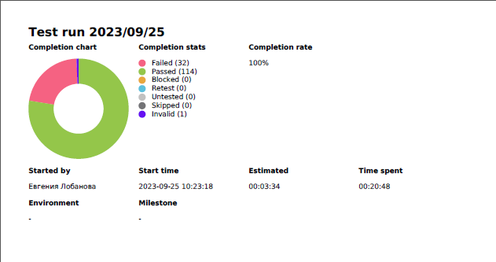

Полный список чек-листов представлен в разделе Приложение

# Глава 7. Тест-кейсы.
## 7.1 Что такое тест‑кейс
*Тест-кейс — это профессиональная документация тестировщика, последовательность действий направленная на проверку какого-либо функционала, описывающая как прийти к фактическому результату.*

### Атрибуты тест‑кейса

*	**Уникальный номер**. Это может быть любая нумерация, принятая в проекте. Он позволит ссылаться на определённые тесты по номеру.

*	**Заголовок.** Кратко, но ёмко описывает конкретную цель тест-кейса ― что именно нужно проверить.

*	**Предусловия.** Условия, которые нужно соблюсти перед началом тест-кейса. Как правило, нужно авторизоваться или находиться в определённом разделе программы.

*	**Окружение.** Где именно работал тестировщик: на каком устройстве, в каком браузере. Иногда его заполняют до тестирования, чтобы указать, на каком именно оборудовании и ПО его проходить. Иногда — после, и тогда тестировщик сам указывает, в каком окружении работал.

*	**Постусловия.** Действия, которые нужно проделать после проведения проверки. Этот пункт встречается редко, но иногда он необходим. Например, может понадобиться удалить внесённые данные, чтобы они не скапливались в базе.

*	**Шаги** ― последовательность шагов, которую нужно проделать для проверки.

*	**Ожидаемый результат тест-кейса.** То, что тестировщик должен получить от системы после или во время прохождения шагов.

*	**Статус.** Passed/Failed, то есть Успех/Провал или другой. Его заполняет тестировщик из заранее определённых вариантов, принятых в команде.

*	**Фактический результат тест-кейса.** То, что получилось после выполнения шагов тест-кейса. Часто этого поля нет, и фактический результат описывают в баг-репорте в случае статуса failed.

### Правила составления тест-кейсов

1.	Заголовок должен быть чётким, лаконичным и выражающим суть проверки. В него не нужно добавлять шаги тест-кейса.

2.	В предусловии важно описать состояние системы, которое нужно для выполнения шагов тест-кейса. Например, там могут быть конкретные ссылки на среды, где проводятся тестирования. Или на документы, которые понадобятся для прохождения шагов.

3.	Шаги тест-кейса не нужно описывать слишком подробно. Например, следует писать «Введите email» вместо «Введите email, нажимая клавиши на клавиатуре».

4.	Шаги не должны быть размытыми или абстрактными. Нельзя сказать «Зайдите в раздел «Магазин» — лучше указать путь к нему, если он не слишком очевиден.

5.	Скриншоты лучше использовать только как дополнение к словесному описанию, но не в качестве его замены.

 ## 7.2 Тест-кейсы диплом
  Тест-кейсы. Тестовая документация находится по адресу:
  
  https://docs.google.com/spreadsheets/d/1iy040cSrP1-dItpuYCpfHmK7i0o1SNrR_oS_gJLOhsw/edit#gid=1220381018 

  Всего заведено: **147 проверок**

  

## Результат прогона чек-листов:
**faild**  - 31

**blocked**- 0

**passed** - 27

**skipped**- 0

**invalid** - 0

  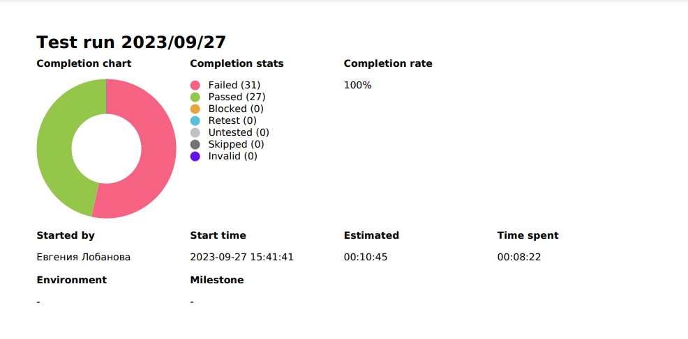

Полный список тест-кейсов представлен в разделе Application

# Глава 8. Баги
## 8.1 Баги теория
**Баг — это отклонение фактического результата от ожидаемого результата.**

* *фактический результат* — это то, что мы “видим” или то, что произошло после проделанных действий

* *ожидаемый результат* — это ожидания наблюдателя, которые он получил из требований, спецификаций, любой другой документации, личного опыта и здравого смысла

**Баг Репорт (Bug Report)** — документ, содержащий информацию о найденном баге.

### Виды багов
* *Функциональные*. Возникают, когда фактический результат работы не соответствует ожиданиям: не получается опубликовать комментарий на сайте, добавить товар в корзину или открыть страницу.
* *Визуальные*. Это случаи, когда приложение выглядит иначе, чем задумано: кнопка накладывается на текст, не отображаются картинки или текст выходит за пределы окна.
* *Логические.* Баг, при котором что-то работает неправильно с точки зрения логики, — например, когда можно указать несуществующую дату (31 февраля) или поставить дату рождения из будущего (2077 год).
* *Дефекты UX.* Приложение или программа неудобны в использовании: при просмотре ленты новостей пользователя постоянно отбрасывает к началу, слишком близко расположены кнопки и вместо одной нажимается другая.
* *Дефекты безопасности.* Случаи, когда из-за ошибки в коде данные пользователей (почты, пароли, фото, информация о платежах) могут быть доступны третьим лицам.

### Жизненный цикл бага
Статус бага в репорте определяется его «жизненным циклом», который состоит из четырех основных стадий:

1. **Открыт (Open)** — тестировщик выявил баг и добавил в репорт.
2. **В работе (In Progress)** — о баге сообщили исполнителю, и он занимается исправлением.
3. **Исправлен (Ready for check)** — исполнитель закончил работу по исправлению бага и передал проект на повторную проверку тестировщику.
4. **Закрыт (Closed)** — баг устранен и больше не воспроизводится.

Кроме основных есть еще несколько статусов:

1. **Отклонен (Rejected)** — исправлению бага помешала ошибка в репорте, например неверный алгоритм в пункте «Шаги к воспроизведению».
2. **Отсрочен (Deferred)** — баг признан неприоритетным и исправление переносится.
3. **Переоткрыт (Reopened)** — баг был отсрочен или отклонен, но теперь исполнитель взял его в работу.

# Критичность и приоритет бага.

***Критичность бага** – это  атрибут, который характеризует влияние бага на общую функциональность разрабатываемого ПО.*

По критичности баги делят на:

* **S1. Блокирующий (Blocker).** Всё тестируемое ПО не может работать без устранения бага. Например, приёмник начинает перезагружаться сразу после включения, мы не сможем больше ничего протестировать из-за этого бага.

* **S2. Критический (Critical).** Большая часть ПО не может корректно работать. Например, приёмник не может открывать закодированные каналы. До устранения этого дефекта можно протестировать UI, а также функционал, не связанный с расшифровыванием каналов.

* **S3. Значительный (Major).** Блокирует работу одной из основных логических цепочек ПО. Например, неправильное сообщение об ошибке при отсутствии подписки на пакет оператора.

* **S4. Незначительный (Minor).** Критичность бага – это  атрибут, который характеризует влияние бага на общую функциональность разрабатываемого ПО.

* **S5. Тривиальный (Trivial).** Эта степень присваивается, когда баг вообще не влияет на общее качество работы ПО. Например, незначительное пересечение элементов в меню.

***Приоритет бага** — это то, в каком порядке нужно решать проблемы.* Существует три степени приоритетности:

* **P1. Высокий приоритет (High).** Нужно исправить немедленно, потому что баг является крайне важным для всего релиза. Например, старое сообщение об отсутствии подписки на пакет, хотя обновление текстов являлось целью этого релиза.

* **P2. Средний приоритет (Medium).** Точно нужно будет исправить, баг достаточно важен, но не требует немедленного решения. Например, некорректный перевод в меню приёмника.

* **P3. Низкий приоритет (Low).** Нужно будет исправить, но баг не очень важный и не требует немедленного решения. Например, это могут быть баги в функционале, который уже не используется оператором, но ещё не был удалён из кода.

## 8.2 Как правильно оформить баг
### Атрибуты баг репорта

*Атрибуты баг репорта можно разделить на 2 группы:*

**Основные** — содержат обязательную информацию, которая должна присутствовать в описании каждого бага

**Дополнительные** — дают дополнительную информацию, которая помогает разработчику быстрее локализовать и найти ошибку

### Основные поля

* **ID** — уникальный идентификатор бага

* **Заголовок / Краткое описание / Тема / Summary / Title** — четко и кратко описывает суть бага. Оформляется в виде одного предложения, состоящего из трех частей отвечающих на вопросы “Что? Где? Когда?”. 

* **Шаги к воспроизведению** — четкое, последовательное описание шагов / действий, которые необходимо совершить, чтоб воспроизвести баг со всей необходимой информацией

* **Фактический результат** — результат, который мы видим

* **Ожидаемый результат** — результат, который мы хотели / ожидали увидеть

* **Серьезность** — показывает, насколько серьезные последствия от дефекта с точки зрения влияния на систему (см. раздел Серьезность)

## Дополнительные поля

* **Скриншот / видео — изображение / видео**, которое четко и наглядно демонстрирует баг. 

* **Требование** — ссылка на требование, которое не соблюдено. 

* **Тип бага** — для анализа “слабых” мест в ПО, баги могут разделять на типы.

* **Приоритет** — очередь, в которой баг будет исправляться (Высокий -> Средний -> Низкий)

* **Дополнительные файлы** — файлы, которые нужны для воспроизведения бага (файлы определенного размера, типа, логи и т.п.)

* **Окружение** — информация об окружении, на котором воспроизводится баг (версия браузера, операционная система, размер экрана, тестовый сервер и т.п.)

* **Статус** — текущий статус бага в его жизненном цикле (Открыт, В работе…)

* **Автор** — человек, который создал баг.

* **Исполнитель** — человек, которые работает над багом в данный момент времени.

* **Комментарии** — обсуждение исправления ошибки

* **Версия** — версия ПО, в которой был обнаружен баг

* **Версия исправления** — версия ПО, в которую будет добавлено исправление бага

### Как правильно оформить баг-репорт

1. Для начала нужно убедиться, что найденный баг ещё не был оформлен. Следует провести поиск его в соответствующем проекте по всем подходящим ключевым словам и\или полям. Если баг уже есть, следует обновить его описание.
2. Если баг не найден – нажимаем на кнопку создания бага. Не стоит забывать важное правило: один дефект - один баг в трекере.
3. Далее нужно постараться кратко описать, что не работает - это и будет заголовок баг-репорта.
4. После этого перейти к подробному описанию бага: указать шаги к воспроизведению.
5. Указать ожидаемый результат. Можно добавить ссылку на спецификацию.
6. Указать полученный результат.
7. Указать версию ПО, также указать версию окружения.
8. Если необходимо, приложить соответствующие артефакты: логи, скриншоты, дампы и т.д.

### Ошибки при создании баг-репорта

**Заголовок не понятен.** Есть риск, что ни разработчик, ни коллеги не обратят внимания на довольно критичную проблему.

**Отсутствуют шаги для воспроизведения.** Есть риск, что разработчик, не поняв как повторить проблему, вернёт баг со статусом «Не воспроизводится».

**Неправильно назначен баг.** Возможно, баг по ошибке был назначен не на того разработчика или вообще остался в статусе “не назначен”. Есть риск, что багу долгое время не будет уделено внимание.

**Недостаточность предоставленных данных.** Не всегда одна и та же проблема проявляется при всех вводимых значениях и под любым вошедшим в систему пользователем, поэтому настоятельно рекомендуется вносить все необходимые данные в баг-репорт. Иначе баг будет отклонён разработчиком, и придётся потратить время на его детальное описание.

**Отсутствие ожидаемого или полученного результата.** В случаях, если вы не указали, что же должно быть ожидаемым поведением системы, вы тратите время разработчика на поиск данной информации, тем самым замедляете исправления дефекта. Рекомендуется указать ссылку на пункт в требованиях, написанный тест кейс или же ваше личное мнение, если эта ситуация не была задокументирована.

 ## 8.3 Баги диплом

 Баги. Тестовая документация находится по адресу:
  
  https://docs.google.com/spreadsheets/d/1iy040cSrP1-dItpuYCpfHmK7i0o1SNrR_oS_gJLOhsw/edit#gid=1220381018 

  Всего заведено: **56 багов**

  

## Результат прогона багов в Jira:

**blocker** - 0

**critical** - 3

**major** - 16

**minor** - 28

**trivial** - 0

  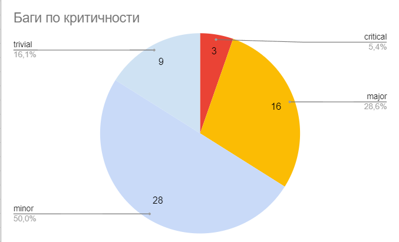

Полный список заведенных багов представлен в разделе Application

# Глава 9. DevTools.
## 9.1  DevTools диплом
 это инструмент, который входит в состав большинства современных браузеров и предназначен для анализа и отладки веб-страниц. 

 ## Использование инструментов для анализа CSS

 Одной из причин возникновения проблем в веб-страницах являются ошибки в CSS. Использование DevTools поможет нам быстро отследить их.

Для этого нужно выбрать нужный элемент на странице и перейти на вкладку Styles в DevTools. Здесь мы увидим весь CSS-код, примененный к выбранному элементу. Если мы сделаем какие-то изменения в CSS-коде, то они отразятся сразу же на странице. Это позволит нам быстро проверить, как изменение в CSS-коде повлияло на веб-страницу.

### Использование инструмента для анализа элементов

Другой инструмент, который поможет нам отследить ошибки на веб-странице, это инструмент для анализа элементов в DevTools. Он позволяет нам быстро определить, какой элемент на странице вызывает проблему.

Для этого нужно нажать на кнопку Inspect element в DevTools и выбрать нужный элемент на странице. Мы увидим, как DevTools подсветит HTML-код, соответствующий выбранному элементу. Здесь мы можем изменять, добавлять и удалять HTML-код, чтобы проверить, как это повлияет на веб-страницу.

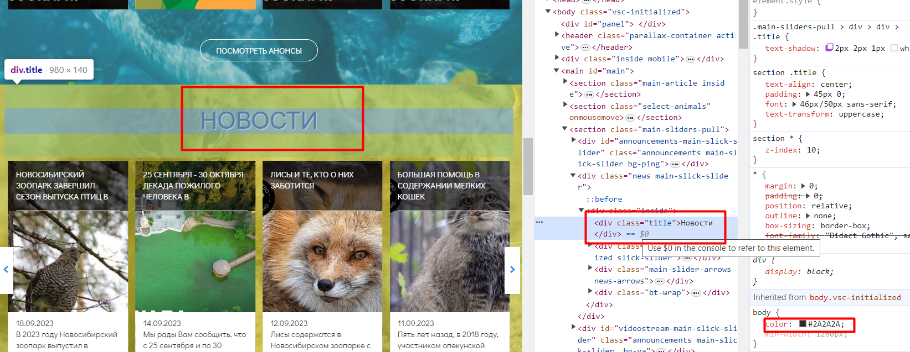

### Использование инструментов для анализа сетевых запросов

Если на веб-странице есть проблемы с сетевыми запросами, то мы можем использовать инструменты для их анализа в DevTools. Например, Network panel позволяет нам увидеть все сетевые запросы на странице и узнать, сколько времени потребовалось для их выполнения.

Также мы можем использовать инструмент для анализа заголовков запросов, чтобы узнать больше о том, как работают веб-серверы и браузеры.

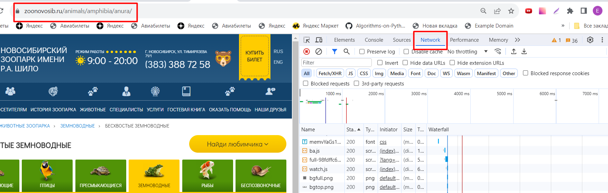
### Использование инструментов для анализа JavaScript

Если на веб-странице есть проблемы с JavaScript, то мы можем использовать инструменты для их анализа в DevTools. Например, Console позволяет нам увидеть все ошибки JavaScript на странице и узнать, какие переменные были определены на момент их возникновения.

Также мы можем использовать инструменты для анализа кода JavaScript, чтобы узнать, как он работает и взаимодействует с другими элементами на странице.

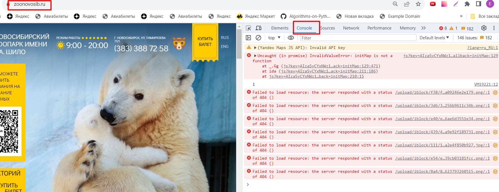

### Результат

Использование DevTools помогает нам быстро и эффективно отслеживать ошибки на веб-страницах. Он предоставляет множество инструментов для анализа CSS, HTML, сетевых запросов и JavaScript, что позволяет нам быстро находить и исправлять проблемы.

Однако, проверка всех страниц вручную может быть очень трудоемкой задачей. Поэтому рекомендуется применять автоматические тесты для быстрого обнаружения проблем в веб-страницах и значительного сокращения времени тестирования.

# Глава 10. Отчет о тестировании.
## Что такое отчет о тестировании?

**Отчет о тестировании** — документ, включающий в себя результаты работ по тестированию и содержащий информацию, достаточную для соотнесения текущей ситуации с тест-планом и принятия необходимых управленческих решений.

### Основные принципы составления отчета о тестировании:

* Подробность: необходимо подробно описывать проделанную работу. Не стоит использовать абстрактные слова, формы и выражения.
* Технический стиль: используйте технический стиль в отчете.
* Стандарт: используйте общепринятый на проекте шаблон отчета.

### Содержание отчета о тестировании
Хоть в каждой компании свои требования, свой формат, свои цели, типичный шаблон сводного отчета о тестировании обычно содержит: 

* **Информацию о проекте** — раздел, в котором кратко описывается содержание отчета. Например, название проекта, фичи, тестируемая версия и т.д.

* **Команда тестировщиков** — список специалистов, задействованных в тестировании проекта, с указанием закрепленного за каждым участником тестируемого функционала. 

* **Описание процесса тестирования** — в этом разделе кратко описывается то, как происходил процесс тестирования, а именно какие использовались методы, техники, инструменты.

* **Краткое описание** — в данном разделе дается краткое описание того, что было протестировано (версия, номер сборки), что тормозит процесс тестирования (критичные дефекты, недоработанная функциональность, пробелы в требованиях).

* **Расписание** — указываются временные сроки тестирования функционала.

* **Статистика по дефектам** — количество дефектов, обнаруженных за отчетный период, с указанием степени важности, срочности, места обнаружения и прочего. 

* **Список новых дефектов** — список дефектов, которые обнаружились в отчётном периоде, с указанием их основных атрибутов.

* **Список устраненных дефектов** — список дефектов, которые были устранены командой разработки в отчетном периоде.

* **Качество объекта тестирования** — экспертное заключение об уровне качества продукта.

* **Рекомендации** — выводы по результатам тестирования и рекомендации по повышению его эффективности в будущем. 

* **Приложения** — графики, таблицы, диаграммы, демонстрирующие числовые характеристики процесса тестирования

## **С отчетом по тестировании сайта можно ознакомиться** 
https://docs.google.com/document/d/1ETpaNz6Bz3wLebeKHOxtND145JhKcTTEiqW4eOgE6Qg/edit?usp=sharing

# Глава 11. Заключение.

Цели и задачи данного проекта были выполнены.

В данном дипломном проекте произведено тестирование сайта Новосибирского зоопарка https://zoonovosib.ru/ 

Основной задачей написания дипломного проекта было, применить на практике полученые знания на обучении, которые потребуются  для ручного тестирования.

В ходе написания дипломного проекта:
* закреплена базовая теория
* использованы техники тест-дизайн 
* произведено тестирование с помощью Devtools
* написан чек-лист в Qase.io с 147 проверками
* написано 58 тест-кейсов в Qase.io 
* заведено 56 багов в багтрекинговой система Jira
* написан отчет о проведенном тестировании

Основной сложностью при тестирование сайта, было отсутствие требований. Поэтому для тестирования сайта использовалось исследователльское тестирование методом черного ящика.

Сайт Новосибирского зоопарка считаю, что нуждается в доработке не все функции работают и не во всех разделах есть полная информация.

# Глава 12. Cписок литературы.

1. Виды отчетов (Reports) // QA bible : сайт. – URL: 
https://vladislaveremeev.gitbook.io/qa_bible/testovaya-dokumentaciya-i-artefakty-test-deliverablestest-artifacts/vidy-otchetov-reports

2. Куликов, С. С. Тестирование программного обеспечения. Базовый курс. (3-е издание) / С. С. Куликов. – Newtown, Pennsylvania : EPAM Systems, 2023. – 301 с. – URL: 
https://svyatoslav.biz/software_testing_book/ 

3. Фундаментальная теория тестирования // Habr : сайт. – URL: https://habr.com/ru/articles/549054/

4. Говорим о тестировании простыми словами https://sedtest-school.ru/nyuansy-testirovaniya/test-plan-chto-eto-i-dlya-chego-nuzhen/

5. Клиент-серверная архитектура в картинках https://habr.com/ru/articles/495698/

# Глава 13. Приложение.
### Тест-план
https://docs.google.com/document/d/1r3CO_qPSa1xSCoaavCildvpIIR0kMfHqxMr6lfhh0nk/edit?usp=sharing

### Чек-лист

https://docs.google.com/spreadsheets/d/1iy040cSrP1-dItpuYCpfHmK7i0o1SNrR_oS_gJLOhsw/edit?usp=sharing

### Тест-кейс

https://docs.google.com/spreadsheets/d/1iy040cSrP1-dItpuYCpfHmK7i0o1SNrR_oS_gJLOhsw/edit?usp=sharing

### Баг-репорты

https://docs.google.com/spreadsheets/d/1iy040cSrP1-dItpuYCpfHmK7i0o1SNrR_oS_gJLOhsw/edit?usp=sharing

### Отчет о тестировании

https://docs.google.com/document/d/1ETpaNz6Bz3wLebeKHOxtND145JhKcTTEiqW4eOgE6Qg/edit?usp=sharing
